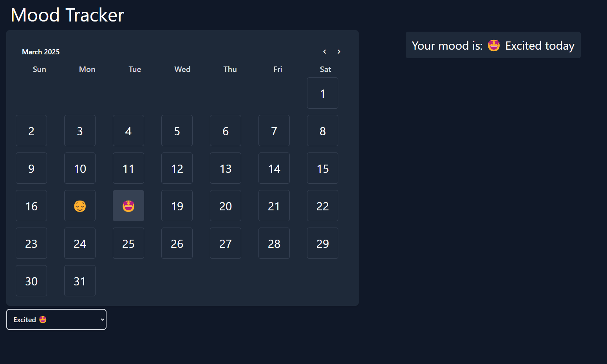

# Daily Mood Tracker

## 📌 Overview
Daily Mood Tracker is a simple and intuitive application designed to help users log their daily moods and track patterns over time. The goal is to encourage self-awareness and emotional well-being through consistent mood tracking.

## Live Link

Go Check the Website from this [Live Link](https://mood-tracker-chai-cohort.vercel.app/);

## Image of the site




## 🚀 Features
- Log your mood daily with predefined mood options.
- Add notes to describe your feelings in more detail.
- View mood trends over time.
- User-friendly interface for easy tracking.
- Secure storage of mood entries.

## 📂 Project Structure
```
masterji-cohort-assigment-01/
│── src/                # Source files
│── public/             # Static assets
│── components/         # Reusable UI components
│── styles/             # CSS/Tailwind styles
│── package.json        # Project dependencies and scripts
│── README.md           # Project documentation
```

## 🛠️ Tech Stack
- **Frontend:** React (with Vite)
- **State Management:** React hooks
- **Styling:** Tailwind CSS
- **Backend:** Node.js (if applicable)
- **Database:** Appwrite (if used)

## 📦 Installation
1. Clone the repository:
   ```bash
   git clone https://github.com/devsujalpatel/masterji-cohort-assigment-01.git
   ```
2. Navigate to the project directory:
   ```bash
   cd masterji-cohort-assigment-01
   ```
3. Install dependencies:
   ```bash
   npm install
   ```
4. Start the development server:
   ```bash
   npm run dev
   ```

## 📜 Usage
1. Open the application in your browser.
2. Select your mood for the day.
3. Optionally, add a note to describe your feelings.
4. Save your mood entry and track your progress.

## ✅ Contributing
Contributions are welcome! To contribute:
1. Fork the repository.
2. Create a new branch: `git checkout -b feature-branch`
3. Commit your changes: `git commit -m 'Add feature'`
4. Push to the branch: `git push origin feature-branch`
5. Create a Pull Request.

## 📄 License
This project is licensed under the MIT License - see the [LICENSE](LICENSE) file for details.

## 📞 Contact
For any issues or suggestions, feel free to open an issue on GitHub or contact on [linkedIn](https://linked.in/in/devsujal).

